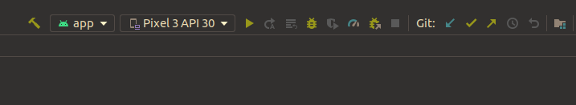

# Readme
The purpose of this repository is to dry-run your local development setup for Android and the [bitcoindevkit](https://github.com/bitcoindevkit). It consists of 2 tasks: 
1. Building the app on the `master` branch of this repository
2. Building the app on the `bdk-library` branch of this repository

## Requirements
To accomplish the two tasks above you will need:
1. Android Studio
2. A phone with Android 6 OS or above (Android Marshmallow, API level 23) with USB debugging activated _OR_ an emulator on your development machine
3. The bitcoindevkit library

### Android Studio
The easiest way to install/uninstall Android Studio is through JetBrains' [Toolbox app](https://www.jetbrains.com/toolbox-app/), but any way you get a working Android Studio on your computer is fine. Install Android Studio `4.2.2` (latest stable release).

### Phone with USB debugging activated
Running your apps on a phone is more fun than using the emulators. Installing apps from Android Studio directly on your phone requires that you (a) have you phone connected to your computer via USB cable, and (b) that you have _USB debugging_ activated. The specifics of how to do this is phone and vendor dependent, so you'll have to figure out how to turn that on for your own phone. It usually consists of turning on _Developer Options_ via something like `Settings -> System -> About Phone -> Software Info -> Build Number` and pressing the `Build number` 7 times. From there you'll find a new section at `Settings -> System -> Developer options`, and there you'll be able to toggle on `USB debugging`. [See this link for more info](https://developer.android.com/studio/run/device). Because all setups are different, expect having to do a bit of googling for this to work.

### Emulators
You can install emulators for a range of devices (that's the beauty of emulators) on any computer directly from Android Studio. Click on the dropdown menu (pictured below) and select `AVD Manager`. From there, follow the instructions and install an emulator of your choosing with a recent API level (Pixel 3 with API 30 is a good choice). Note that there is a known issue with emulators on Ubuntu OS which makes them very slow. In general if your local development machine runs on a Linux distro, consider using a phone for testing/debugging.

### Bitcoindevkit library
The bitcoindevkit library for Android [bdk-jni](https://github.com/bitcoindevkit/bdk-jni) is not yet available on public repositories of Android libraries. This means that in order to acquire it, one must either (a) build it from source, or (b) find a pre-built version provided elsewhere.

The second option is the easiest, and we have provided the library to you for that purpose. Once you have downloaded the library, you'll need to copy it in a place called your _local maven repository_, located at `~/.m2/repository` (create it if it doesn't exist). Simply copying the directory we provided there should result in the following directory structure:

```sh
~/.m2 
➜ tree
.
└── repository
    └── org
        └── bitcoindevkit
            └── bdkjni
                ├── bdk-jni
                │   ├── 0.2.1-dev
                │   │   ├── bdk-jni-0.2.1-dev.aar
                │   │   ├── bdk-jni-0.2.1-dev.module
                │   │   └── bdk-jni-0.2.1-dev.pom
                │   └── maven-metadata-local.xml
                └── bdk-jni-debug
                    ├── 0.2.1-dev
                    │   ├── bdk-jni-debug-0.2.1-dev.aar
                    │   ├── bdk-jni-debug-0.2.1-dev.module
                    │   └── bdk-jni-debug-0.2.1-dev.pom
                    └── maven-metadata-local.xml
```
 
Note that for the build tool (Gradle) to find the library, we indicate to it that it should have a look into the "local Maven" repository for any of its dependencies (see `build.gradle.kts` line 17 in the `bdk-library` branch) 
```kotlin:17
allprojects {
    repositories {
        google()
        mavenCentral()
        mavenLocal()
    }
}
```

If you're familiar with the Rust toolchain, feel free to try option (a) and build from source. [The readme](https://github.com/bitcoindevkit/bdk-jni) is comprehensive and should lead to a successful build.

## Run the app
Once you have all of the above, you should be able to open this repository in Android Studio, choose a device in the dropdown menu (emulator or USB connected hardware) and simply press 'run' (the green triangle). The app should fire up on your phone, fully installed (in other words you can disconnect your phone and the app will keep working).
 
<center>
    
</center>

## Expected output

<center>
    
</center>


